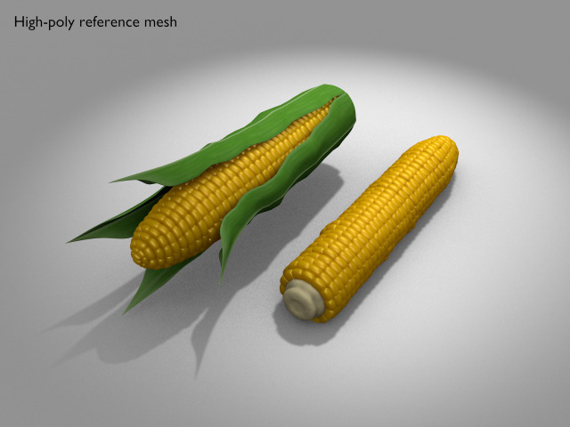
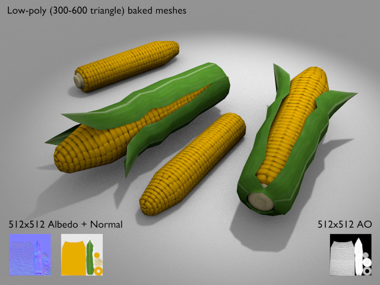
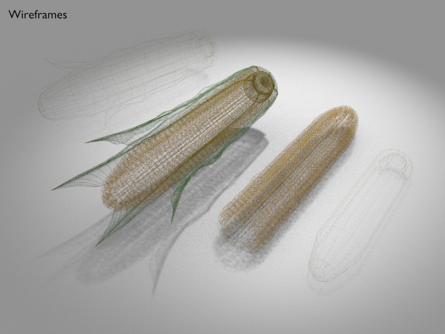

Corn
===






License
===

```
© 2016 Mark Raynsford <visual@io7m.com>

This work is licensed under a Creative Commons Attribution 4.0
International License.

You should have received a copy of the license along with this
work. If not, see <http://creativecommons.org/licenses/by/4.0/>.

```

Scene statistics
===

```
Mesh: hp_kernels_mesh
  Polygons: 25200
  Textures:

Mesh: hp_kernels_mesh.001
  Polygons: 25200
  Textures:

Mesh: hp_kernels_mesh.002
  Polygons: 25200
  Textures:

Mesh: hp_leaf_mesh.000
  Polygons: 6272
  Textures:
    Image: corn_leaf.png 512x512
    Image: leaf_albedo 1024x256
    Image: corn_leaf_bump.png 512x512
    Image: corn_leaf_detail 512x512

Mesh: hp_leaf_mesh.001
  Polygons: 6272
  Textures:
    Image: corn_leaf.png 512x512
    Image: leaf_albedo 1024x256
    Image: corn_leaf_bump.png 512x512
    Image: corn_leaf_detail 512x512

Mesh: hp_leaf_mesh.002
  Polygons: 6272
  Textures:
    Image: corn_leaf.png 512x512
    Image: leaf_albedo 1024x256
    Image: corn_leaf_bump.png 512x512
    Image: corn_leaf_detail 512x512

Mesh: hp_leaf_mesh.003
  Polygons: 6272
  Textures:
    Image: corn_leaf.png 512x512
    Image: leaf_albedo 1024x256
    Image: corn_leaf_bump.png 512x512
    Image: corn_leaf_detail 512x512

Mesh: hp_leaf_mesh.004
  Polygons: 6272
  Textures:
    Image: corn_leaf.png 512x512
    Image: leaf_albedo 1024x256
    Image: corn_leaf_bump.png 512x512
    Image: corn_leaf_detail 512x512

Mesh: hp_leaf_mesh.005
  Polygons: 6272
  Textures:
    Image: corn_leaf.png 512x512
    Image: leaf_albedo 1024x256
    Image: corn_leaf_bump.png 512x512
    Image: corn_leaf_detail 512x512

Mesh: hp_leaf_mesh.006
  Polygons: 6272
  Textures:
    Image: corn_leaf.png 512x512
    Image: leaf_albedo 1024x256
    Image: corn_leaf_bump.png 512x512
    Image: corn_leaf_detail 512x512

Mesh: hp_leaf_mesh.007
  Polygons: 6272
  Textures:
    Image: corn_leaf.png 512x512
    Image: leaf_albedo 1024x256
    Image: corn_leaf_bump.png 512x512
    Image: corn_leaf_detail 512x512

Mesh: lp_no_leaves_joined_mesh
  Polygons: 368
  Textures:
    Image: lp_corn_albedo 512x512
    Image: lp_corn_ao 512x512
    Image: lp_corn_normals 512x512

Mesh: lp_with_leaves_joined_mesh
  Polygons: 608
  Textures:
    Image: lp_corn_albedo 512x512
    Image: lp_corn_ao 512x512
    Image: lp_corn_normals 512x512

```

