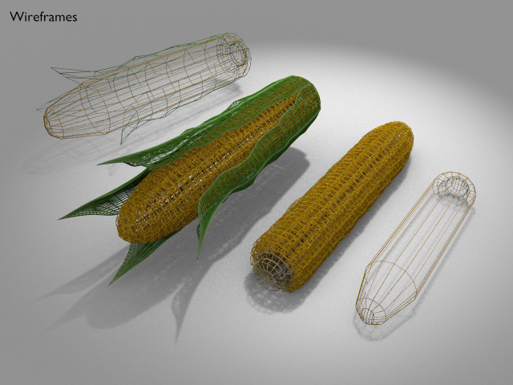

Corn
===





License
===

```
© 2016 Mark Raynsford <visual@io7m.com>

This work is licensed under a Creative Commons Attribution 4.0
International License.

You should have received a copy of the license along with this
work. If not, see <http://creativecommons.org/licenses/by/4.0/>.

```

Scene statistics
===

```
Mesh: corn_kernel_duplicates_mesh
  Polygons: 496

Mesh: corn_kernel_single_vertex_mesh
  Polygons: 112
  Textures:

Mesh: corn_leaf_mesh.000
  Polygons: 32
  Textures:
    Image: corn_leaf 2048x256

Mesh: corn_leaf_mesh.001
  Polygons: 32
  Textures:
    Image: corn_leaf 2048x256

Mesh: corn_leaf_mesh.002
  Polygons: 32
  Textures:
    Image: corn_leaf 2048x256

Mesh: corn_leaf_mesh.003
  Polygons: 32
  Textures:
    Image: corn_leaf 2048x256

Mesh: corn_leaf_mesh.004
  Polygons: 36
  Textures:
    Image: corn_leaf 2048x256

Mesh: corn_leaf_mesh.005
  Polygons: 36
  Textures:
    Image: corn_leaf 2048x256

Mesh: corn_leaves_outer_mesh
  Polygons: 40
  Textures:
    Image: corn_leaves_outer 1024x512

Mesh: corn_mesh
  Polygons: 128
  Textures:

Mesh: corn_stalk_mesh
  Polygons: 40
  Textures:
    Image: corn_stalk 512x512

```

